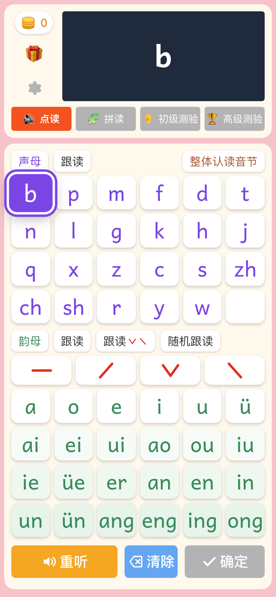
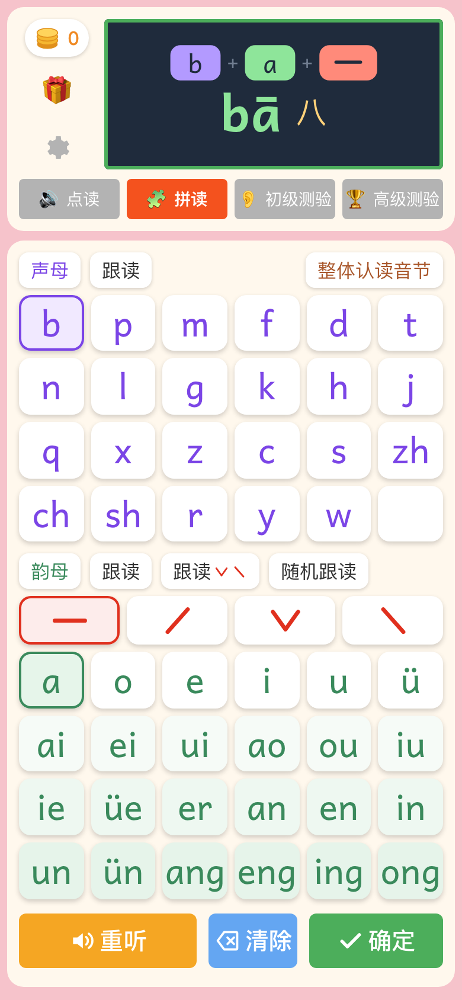
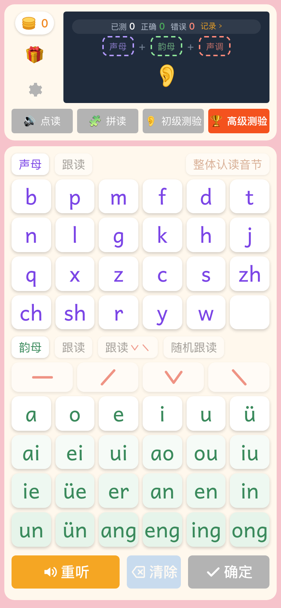
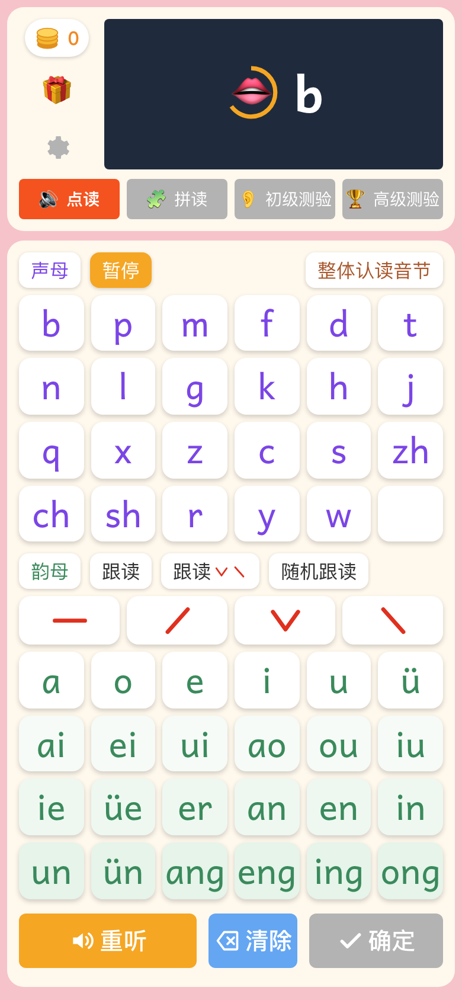

# 拼音学习机

一台会说话的拼音键盘：点读、拼读、跟读、测验，适合儿童或学习汉语者进行拼音学习与测验。

在线地址：**<https://pinyin.jiaci.app>**（iPad 上「添加到主屏幕」后可离线使用，见下文）。

- **不用识字也能自己用**：每一步操作、每一句提示都有语音，屏幕上的文字只是给家长 / 老师看的字幕。
- **发音准**：声母、韵母、音节全部是真人录音，不是合成的；引导语与例字词语用神经语音合成。
- **纯前端、离线**：没有后端、不用注册，安装到平板后断网也能用；进度、金币、记录都存在设备本地。
- **家长少操心**：出题范围跟着「学到第几课」走，常错的会多考；金币换礼物由家长兑现，家长设置藏在长按齿轮 + 一道加法题后面。

<p align="center">
  
  
  
  
</p>

```bash
npm install
npm run dev        # http://localhost:5173
npm run build      # vue-tsc --noEmit && vite build → dist/
npm run typecheck
npm test           # vitest：标调 / 拼写规则、题库、录音包完整性
npm run audio      # 重新生成 public/audio/（见下文）
npm run screenshots  # npm run dev 之后：无头 Chrome 模拟 iPhone 截 README 用的预览图到 screenshots/
```

## 功能

| 模式 | 孩子怎么用 |
|---|---|
| **点读** | 点声母 / 韵母 / 整体认读音节听呼读音；点一个韵母再点声调，听带调的音（ā á ǎ à）。单独点声调键读 ā á ǎ à 示范。 |
| **拼读** | 声母 → 韵母 → 声调，按「确定」听 **b → ā → bā** 三段演示（三拼四段：g → u → ā → guā），部件与按键同步点亮，最后显示例字。<br>三拼：先点声母，再点 i / u / ü，再点能接的韵母（键上出现「介」角标），自动变成介母。<br>j q x y 后点 u 会自动改成 ü 并讲一遍儿歌；zh + i 这类拼出整体认读音节的组合会提示「整体读，不拆」。 |
| **初级测验** | 听音找拼音。默认「四选一」：只亮 4 个键（正确项 + 3 个易混的），点错的键变灰，3 次没点对就闪烁正确键让孩子点一下。 |
| **高级测验** | 听音拼音节：听题时屏幕上就显示这个音的例字（爸），拼好按确定。答错只清掉错的那一段（声母 / 韵母 / 声调），保留对的；答对（或三次错后揭晓）再显示并朗读例字的一两个词语（爸爸 · 爸妈）。<br>显示屏顶上有「已测 / 正确 / 错误」统计条，点开是今天的逐题记录（拼音、例字、几次答对、时间，点一下回放），可导出成一张图片分享；「重新测验」清空记录从头开始。记录只存在本设备，隔天自动重新开始。 |
| **跟读** | 一组（声母 / 韵母 / 韵母四声 / 整体认读音节 / 整体认读音节四声）从头到尾连着播，每个示范后留 2 秒让孩子开口（屏幕显示 👄 和倒计时环）。播放中再点一次「跟读」暂停，再点从暂停的地方继续；点任何拼音键则停止。「随机跟读」把键盘上的声母（或整体认读音节）和韵母打乱一起播。 |

- 出题范围跟随家长设置的「学到第几课」（按小学语文教材的拼音 14 课顺序：ɑ o e → i u ü → b p m f → … → ɑng eng ing ong），常错的键会更常出现。
- 每轮 10 题，第一次答对给满额金币，第二次减半；每天完成第一轮额外 +10。
- 🎁 礼物由家长兑现：孩子点想要的礼物 → 弹出「请爸爸妈妈来」→ 家长答一道两位数加法确认。
- 布局：手机、平板竖屏、横屏各有一套，键高都按屏幕高度算，整个键盘尽量一屏放下；手机上金币 / 礼物 / 设置竖排在显示屏左边，iPad 横屏等矮宽视口改为左（显示屏）右（键盘）两栏；手机底部三键固定，候选键 / 闪烁键会自动滚到可见位置。
- 家长区：**按住右上角齿轮 1.2 秒**，答一道加法题进入。可设学到第几课、测验难度、题数、跟读间隔、音量、礼物清单与价格、金币加减，看每天的练习记录和常错项，生成 / 恢复备份码（浏览器可能清掉本地数据）。
- 开源、干净：代码全部以 MIT 许可公开在这个仓库里，谁都能查、也能自己部署一套；免费、无广告、不用注册、不收集个人信息，录音全部打包在应用里。键盘下面的页脚和家长设置「关于」都写着这一句并链到仓库；「分享给朋友」一键调系统分享面板（微信里教用右上角菜单，电脑上复制一段话 + 链接）；「联系站长」弹作者微信二维码。

## 发音

全部拼音都是真人录音（`public/audio/`，约 3700 个 mp3、16 MB），浏览器 TTS 只在个别文件缺失时兜底：

- 声母呼读音、韵母（含四声）、整体认读音节（含四声）：教材配套的呼读音录音包（du.hanyupinyin.cn，许可未明确，仅个人使用）。
- 全部普通话音节 × 四声：同一站群的音节表录音（yinjie.hanyupinyin.cn，许可未明确，仅个人使用）；它没有的生僻音节（lo、dia、yong 等 35 个）用 [hugolpz/audio-cmn](https://github.com/hugolpz/audio-cmn)（CC BY-SA 3.0）补。个别听感不对的音节可放进 `audio-src/overrides/` 覆盖。
- 引导语（「答对了，真棒」等 44 条）与例字词语（「爸爸」「爸妈」等 1887 条，高级测验答对后朗读）：Microsoft Edge 神经语音（edge-tts）合成。新增一条引导语要同时改 `src/data/prompts.ts` 与 `scripts/build-audio.py` 的 PROMPTS；词语只改 `src/data/words.ts`（脚本直接读这张表）；然后 `npm run audio`。

来源、许可与署名见 `public/audio/CREDITS.md`；命名规则与重新生成方法见 `public/audio/README.md`（`scripts/build-audio.py`：裁静音、响度归一、统一转 24kHz mono 48kbps）。原始录音里 audio-cmn 的部分随项目放在 `audio-src/`，许可未明确的两套（teacher / yinjie）不在仓库里，重新生成前要先按 `audio-src/README.md` 下载。
`src/data/__tests__/manifest.test.ts` 会检查键盘能拼出的每个音节都有录音（已知缺口只有 `yo`）。

播放引擎（`src/services/audio.ts`）：单个 AudioContext 在第一次触摸时解锁（iPad 上后续序列播放不再受手势限制），核心按键预解码，音节按需加载；`file://` 打开时退化为 `<audio>` 元素。

## 部署与装到 iPad

纯静态站：`npm run build` 后把 `dist/` 整个放到任何支持 HTTPS 的静态托管（nginx、对象存储、Pages 服务都行），不需要服务端。`base: './'`，放在子目录也能跑。

- 已注册 Service Worker（vite-plugin-pwa，`registerType: 'autoUpdate'`）：预缓存只有页面外壳（代码、字体、图标、录音清单，几秒装好），3700 个录音（约 17 MB）由页面在后台分批下进另一个缓存（按构建时生成的 `media.json` 里的内容哈希只补缺的、换改过的，断了下次接着下），都下好后断网可用；重新部署后再打开会自动换新版本。页脚最上面的版本卡片显示当前版本（构建时刻）与离线录音包下到哪了，点「检查更新」会和服务器上的 `version.json`（构建时一起生成）比对，有新版本就下载变了的文件并自动刷新；没更新成功还能「重新安装」（清掉缓存重新下载，学习记录和金币不丢）。
- 没从主屏幕打开时，页面顶上有一条给家长的「安装 拼音学习机」提示：Android / 电脑 Chrome、Edge 点「安装」直接弹系统安装框；iPad / iPhone 点「怎么做」看步骤（Safari 分享 → **添加到主屏幕**，不在 Safari 里先教换 Safari）；微信 / QQ 里教先在浏览器打开。关掉 3 天后再提示，装好就不再出现；家长设置 → 数据 里也有「安装到主屏幕」入口。桌面图标启动是全屏、离线可用。自己部署时**必须是 HTTPS**（局域网 http 地址不行，Service Worker 不会注册）。
- 进度、金币、记录都在这台设备的 localStorage 里，换设备用家长区的备份码。
- 访问统计（可选）：本机 `.env` 里同时写 `VITE_UMAMI_SCRIPT=https://你的统计站/script.js` 与 `VITE_UMAMI_WEBSITE_ID=<站点 id>`，正式构建会往 `index.html` 的 `<head>` 里加一行 [Umami](https://umami.is)（开源、无 cookie）的上报脚本，只记页面、来源、设备与地区，进度与测验记录不上报；两项都不配就什么都不加。逻辑在 `src/services/analytics.ts`（可单测）。

## 同一作者的其它学习应用

页面底部的「更多应用」链到这三个站：

- [AI加词](https://jiaci.app)：背单词，FSRS 间隔重复、AI 填充的词条资料、真人级发音。
- [同步练-对战版](https://tongbulian.jiaci.app)：把人教版课本的知识点测验变成游戏积分，谁先答对 8 题谁赢——打机器人、两人一台或多设备扫码组队；也能一个人安静地练，汉字注音、题目朗读。
- [识字卡片](https://kapian.jiaci.app)：2–4 岁看图听音认知卡片，中英文、离线。

## 联系作者

哪个音读得不准、想要什么功能，欢迎加作者微信直接说（页脚与家长设置「关于」里的「联系站长」是同一张二维码）：


## 结构

```
src/
  data/pinyin.ts        声母 / 韵母 / 整体认读 / 介母、标调与拼写规则（含三拼）
  data/units.ts         拼音 14 课的分课表（教材顺序）
  data/syllables.ts     音节 → 四声例字表
  data/words.ts         例字 → 词语表（对应 public/audio/w-*.mp3）
  data/prompts.ts       引导语文本（对应 public/audio/p-*.mp3）
  data/sounds.ts        「要播什么」→ 录音 key + TTS 兜底文字
  data/sites.ts         站点地址、源码仓库、「开源」一句、分享文案、页脚「更多应用」里同一作者另外三个站的名单、站长微信二维码
  services/audio.ts     播放引擎（录音优先，TTS 兜底）
  services/speech.ts    浏览器 TTS 兜底
  services/sfx.ts       答题音效（WebAudio 合成）
  services/report.ts    高级测验记录 → 可分享的 PNG（canvas）
  services/share.ts     分享给朋友：按环境选系统分享面板 / 微信菜单提示 / 复制（纯逻辑可单测）；面板状态在 store/share.ts
  services/analytics.ts 访问统计（可选）：按 .env 的 VITE_UMAMI_* 生成上报脚本标签（vite.config.ts 构建时写进 index.html）
  services/offline.ts   离线录音包：照 media.json 在后台把录音下进缓存（只补缺 / 换改过的、可断点续传、下完清旧），状态在 store/offline.ts
  services/version.ts   当前版本与手动更新：比对 version.json、让 SW 换新版本后重新载入、重新安装、重新载入后报结果（纯逻辑可单测）
  store/state.ts        界面状态（模式、选择、屏幕、按键高亮）
  store/runner.ts       独占的声音序列（AbortController）
  store/session.ts      模式切换、按键分发、点读 / 拼读逻辑、拼读演示
  store/quiz.ts         两种测验：题库（按课过滤、薄弱优先）、判分、纠错
  store/echo.ts         跟读
  store/progress.ts     金币 / 记录 / 高级测验逐题记录 / 礼物 / 家长设置的持久化（key pinyinxuexiji:v1，带迁移）
  components/           顶栏、显示屏、键盘、声调行、底部三键、页脚的版本卡片、礼物 / 家长 / 高级测验记录弹窗
scripts/build-audio.py  生成音频包
scripts/screenshots.mjs README 用的预览图 → screenshots/（不进构建产物）
public/fonts/           Andika（SIL OFL）：ɑ ɡ 单层字形 + 全部声调符号，离线可用
```
